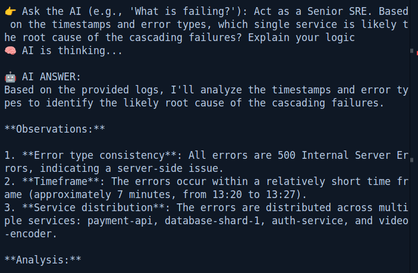
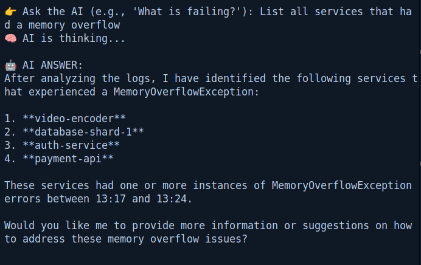

# 🔍 LogSenseAI: Autonomous SRE Agent


**LogSenseAI** is a real-time log intelligence system. It ingests high-velocity logs via **Redis**, stores them in **ChromaDB**, and uses **RAG (Retrieval Augmented Generation)** to perform Root Cause Analysis on microservices failures instantly.

---

## ⚡️ See it in Action

### 1. Autonomous Root Cause Analysis
The system doesn't just read logs; it correlates timestamps across services to find the "Patient Zero" of a cascading failure.



### 2. Natural Language Discovery
Forget `grep`. Just ask questions in plain English.



---

## 🏗 Architecture

```mermaid
graph LR
    A[Log Generator] -->|JSON Stream| B(Redis Queue)
    B -->|Ingest Worker| C{Vector Embeddings}
    C -->|Store| D[(ChromaDB)]
    E[User] -->|Question| F[RAG Agent]
    F -->|Semantic Search| D
    D -->|Context| F
    F -->|Llama-3 Reasoning| E
